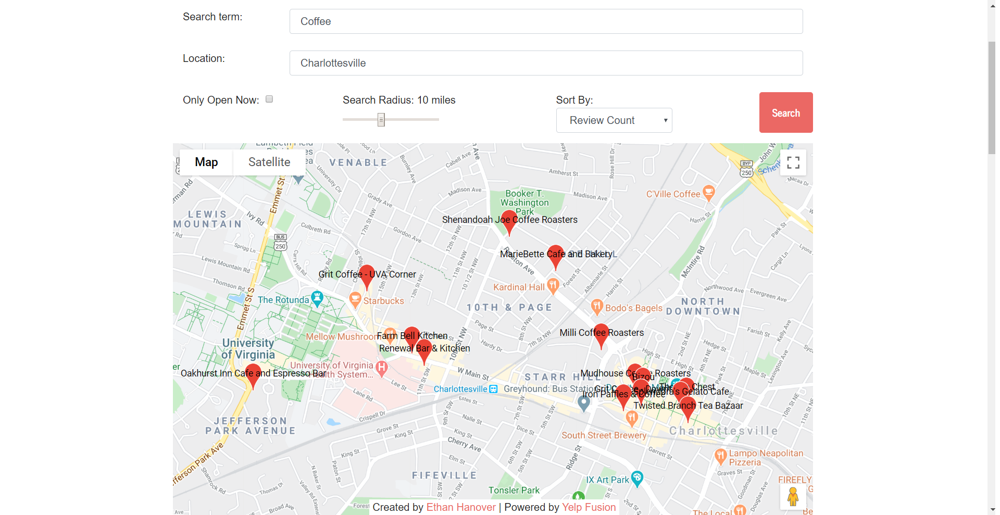
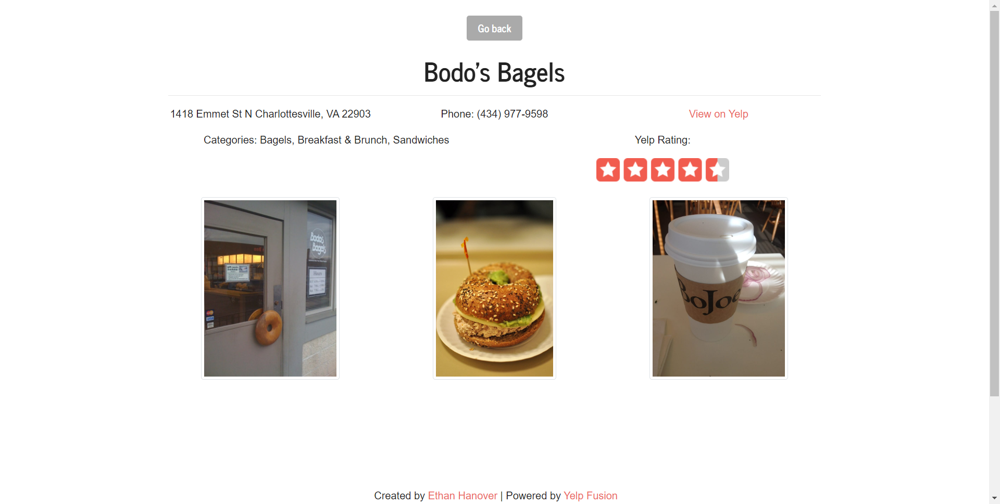
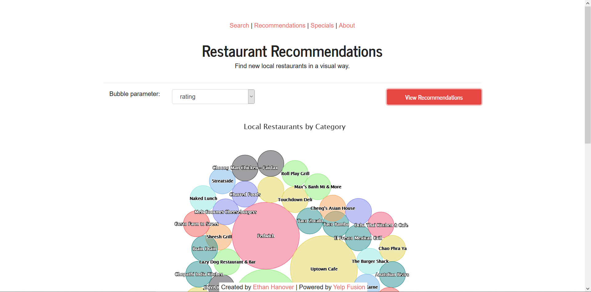

# Restaurant Search Website
##### My submission for the 2020 Capital One Software Engineering Summit
## [Visit the website here!](https://ehanover-c1-ses.herokuapp.com/)

  

*Update - I was selected to attend the Summit!*

### About the project
This website is made with [Vue.js](https://vuejs.org/) as the project framework, [Bootstrap](https://getbootstrap.com/) for the front-end design, Highcharts and Google Maps for displaying data, and the Yelp and Zomato APIs for gathering data.

### About me
I'm an engineering student at the Universitiy of Virginia studying computer science. I love casually making personal projects on my own - I think they're a great way to learn new skills while having fun. Check out my other GitHub repositories for some of my favorite projects.

### Future extensions
- Use a backend (maybe with Node.js) to allow more data processing and advanced API functionality
- Implement Twitter API to see tweets about a location and restaurant
- Use Yelp's menu data to display the restaurant menu
- Add a word frequency chart to show popular words in restaurant reviews
- Try replacing Vue another web framework like Angular or React

___
##### Note: To run this website locally, edit the ```.env``` file and add the required API credentials.